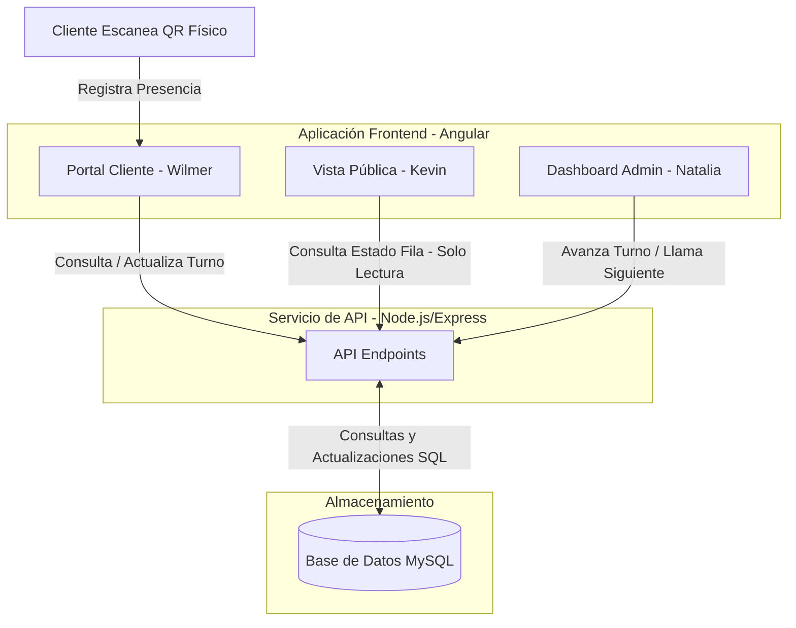

# Fila-Cero 🚀
### Descentralización y Gestión de Tiempos de Espera
*Universidad Tecnológica de Panamá - Centro Regional de Coclé*

---

## 📋 Resumen del Proyecto

**Fila-Cero** es una plataforma web para la gestión de filas de espera que elimina por completo la necesidad de hardware físico (como tiqueteras, dispensadores de papel térmico o pantallas dedicadas) mediante una arquitectura 100% en la nube. 

El flujo de uso principal es:
1. **Consulta de Ocupación:** Los usuarios pueden ver en tiempo real cuántas personas hay en fila antes de salir de casa mediante una URL pública de solo lectura.
2. **Obtención de Turno:** Al llegar al local, el cliente escanea un código QR físico in-situ, el cual le genera un turno digital en su navegador web sin necesidad de descargar aplicaciones ni registrarse.
3. **Espera Remota:** El cliente puede monitorear su avance en tiempo real (cuántas personas tiene por delante y tiempo estimado) y esperar cómodamente desde su auto, una cafetería o la zona que desee.
4. **Gestión Administrativa:** El personal de atención gestiona la cola y llama a los turnos a través de un panel web administrativo en tiempo real.

---

## 👥 Roles de Desarrollo y Responsabilidades

El proyecto se desarrolla bajo una arquitectura de **Monorepo** para facilitar la integración de la aplicación web y la API de backend. El frontend está estructurado en Angular y el trabajo se divide de la siguiente manera:

| Desarrollador | Rol / Componente | Ubicación en el Frontend | Descripción |
| :--- | :--- | :--- | :--- |
| **Kevin Mena** | **Vista Pública de Ocupación** | `frontend/src/app/pages/public-occupancy/` | Vista de solo lectura. Muestra la cantidad de personas en fila para que los usuarios consulten el estado antes de ir al comercio. |
| **Wilmer Morales** | **Portal de Turno del Cliente** | `frontend/src/app/pages/client-portal/` | Vista dinámica del cliente tras escanear el QR. Muestra su número de turno, personas por delante y tiempo estimado de espera. |
| **Natalia Bernal** | **Dashboard Administrativo** | `frontend/src/app/pages/admin-dashboard/` | Panel para el operador comercial. Permite avanzar turnos, pausar/cerrar la fila y ver métricas de atención. |

---

## 🛠️ Estructura del Monorepo

```text
Fila Cero/ (Raíz del Monorepo)
├── .git/                  # Configuración de Git
├── .gitignore             # Exclusión de archivos y carpetas (ej. node_modules)
├── README.md              # Documentación general y flujo de trabajo (Este archivo)
├── Fila-Zero.docx         # Documento oficial con el planteamiento del proyecto
├── backend/               # Servidor de API y conexión a base de datos (MySQL)
└── frontend/              # Aplicación Frontend en Angular (anteriormente fila-cero-app)
    ├── src/
    │   ├── app/
    │   │   ├── core/      # Servicios globales y guardias de seguridad
    │   │   ├── shared/    # Componentes y tuberías reutilizables
    │   │   └── pages/     # Vistas principales del proyecto
    │   │       ├── public-occupancy/  📂 Asignado a Kevin
    │   │       ├── client-portal/     📂 Asignado a Wilmer
    │   │       ├── admin-dashboard/   📂 Asignado a Natalia
    │   │       └── queue-management/  📂 Control general del estado de la fila
```

---

## 📊 Diagrama de Flujo y Trabajo

El siguiente diagrama ilustra la arquitectura de interacción del sistema y cómo se conecta cada vista con el flujo de información de la fila:



---

## 🚀 Flujo de Trabajo en Git

Para facilitar la integración de las vistas que dependen unas de otras y evitar la fricción de abrir Pull Requests constantes para pruebas rápidas, **el equipo trabajará directamente sobre la rama `dev`**.

### Flujo diario en la rama `dev`:

1. **Antes de empezar a trabajar (Actualizar rama local):**
   Asegúrate de traer los últimos cambios que hayan subido tus compañeros para evitar conflictos:
   ```bash
   git checkout dev
   git pull origin dev
   ```

2. **Realizar Commits descriptivos:**
   Agrega tus cambios e intenta hacer commits específicos indicando qué área estás modificando:
   ```bash
   git add .
   git commit -m "feat(public-occupancy): agregado dashboard de ocupación"
   ```

3. **Subir cambios directamente:**
   Sube tus aportes directamente a la rama de desarrollo:
   ```bash
   git push origin dev
   ```

4. **Rama `main` (Estable):**
   La rama `main` quedará reservada para versiones estables listas para entrega. Solo se realizarán fusiones (`merge`) de `dev` a `main` cuando se finalice una etapa importante y probada del proyecto.

## 🖥️ Configuración del Servidor y Base de Datos (MySQL + Node.js)

Para que el proyecto funcione de forma sincronizada entre la PC (administrador) y el celular (cliente), la aplicación depende de una base de datos MySQL centralizada y un servidor API en Node.js.

### 1. Inicialización de la Base de Datos (MySQL)
Para crear la base de datos, configurar sus tablas y relaciones, y cargar los datos de prueba iniciales:
1. Abre el panel de control de **XAMPP** y asegúrate de iniciar el módulo **MySQL**.
2. Ejecuta el script SQL localizado en [fila_cero.sql](file:///c:/Users/kjmg2/Documents/Fila%20Cero/frontend/database/fila_cero.sql) en la consola de comandos de tu sistema:
   ```bash
   # Si mysql está configurado en tus variables de entorno (PATH)
   mysql -u root -e "source frontend/database/fila_cero.sql"
   
   # O directamente usando la ruta por defecto de XAMPP en Windows
   & C:\xampp\mysql\bin\mysql.exe -u root -e "source frontend/database/fila_cero.sql"
   ```

---

### 2. Configuración y Arranque del Backend (Node.js)
El backend actúa como el intermediario de red que lee y escribe las filas en MySQL:
1. Abre una consola en el directorio `/backend`.
2. Instala las dependencias iniciales del proyecto:
   ```bash
   npm install
   ```
3. Crea un archivo `.env` en la carpeta `/backend` con la configuración de tu base de datos (puedes usar valores vacíos si usas la configuración predeterminada de XAMPP):
   ```env
   PORT=3000
   DB_HOST=127.0.0.1
   DB_USER=root
   DB_PASSWORD=
   DB_NAME=fila_cero
   ```
4. Arranca el servidor API:
   ```bash
   # Ejecución ordinaria
   npm start
   ```

---

### 3. Arranque del Frontend (Angular)
El frontend se conecta al backend usando la IP local de tu PC de forma totalmente dinámica:
1. Abre una consola en el directorio `/frontend`.
2. Arranca el servidor de desarrollo de Angular exponiéndolo a la red local (para permitir la conexión desde dispositivos móviles):
   ```bash
   npx ng serve --host 0.0.0.0 --port 4300
   ```
3. En la consola del frontend verás las direcciones de red:
   * **Local**: `http://localhost:4300/`
   * **Network (Red)**: `http://192.168.x.x:4300/`

> [!IMPORTANT]
> Abre siempre la pantalla de Kiosco QR (`/qr`) en la PC utilizando la dirección de la red local (`http://192.168.x.x:4300/qr`). Esto asegurará que el código QR dinámico que aparezca en pantalla apunte a la IP de tu PC y que los celulares puedan escanearlo y reclamar turnos sin problemas de red.

---

## 📐 Estructura y Relaciones de la Base de Datos
El diseño relacional sigue la siguiente estructura de entidades definida en la base de datos de prueba:

```mermaid
erDiagram
    roles ||--o{ usuarios : "tiene"
    usuarios ||--o{ usuario_establecimiento : "administra"
    establecimientos ||--o{ usuario_establecimiento : "es administrado por"
    establecimientos ||--o{ filas : "tiene"
    filas ||--o{ turnos : "tiene"
    turnos ||--o{ eventos_turno : "genera"
    usuarios ||--o{ eventos_turno : "registra"

    roles {
        int id PK
        string nombre UNIQUE
    }

    usuarios {
        int id PK
        int rol_id FK
        string nombre
        string correo UNIQUE
        string password_hash
        boolean activo
        timestamp creado_en
    }

    establecimientos {
        int id PK
        string nombre
        string slug UNIQUE
        string ciudad
        string direccion
        enum estado
        time hora_apertura
        time hora_cierre
        string url_publica
        string url_qr
        timestamp creado_en
    }

    usuario_establecimiento {
        int usuario_id PK, FK
        int establecimiento_id PK, FK
    }

    filas {
        int id PK
        int establecimiento_id FK
        string prefijo
        int numero_actual
        int ultimo_numero
        int tiempo_promedio_min
        boolean activa
        timestamp creada_en
    }

    turnos {
        int id PK
        int fila_id FK
        string codigo
        int numero
        string token_cliente UNIQUE
        enum estado
        enum origen
        timestamp creado_en
        datetime llamado_en
        datetime finalizado_en
    }

    eventos_turno {
        int id PK
        int turno_id FK
        int usuario_id FK
        enum evento
        string detalle
        timestamp creado_en
    }
```
