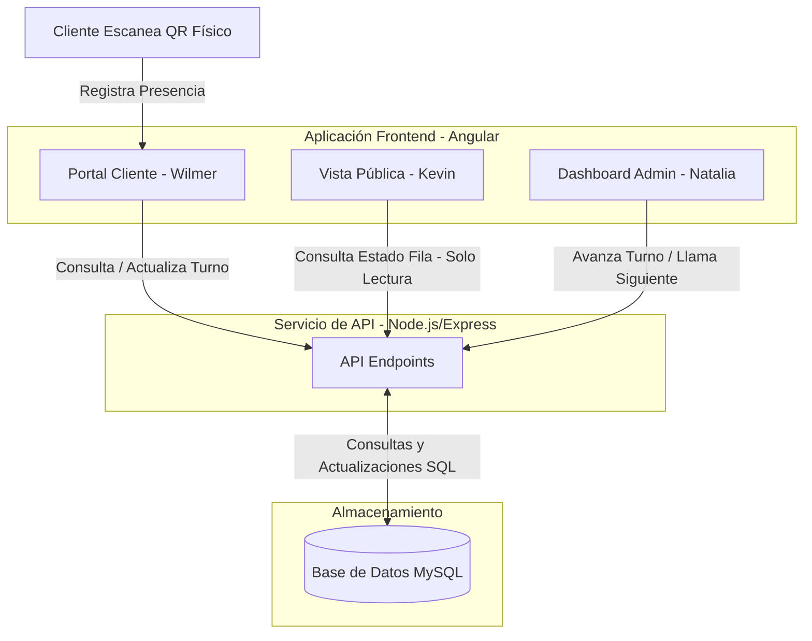

# Fila-Cero 🚀
### Descentralización y Gestión de Tiempos de Espera
*Universidad Tecnológica de Panamá - Centro Regional de Coclé*

---

## 📋 Resumen del Proyecto

**Fila-Cero** es una plataforma web para la gestión de filas de espera que elimina por completo la necesidad de hardware físico (como tiqueteras, dispensadores de papel térmico o pantallas dedicadas) mediante una arquitectura 100% en la nube. 

El flujo de uso principal es:
1. **Consulta de Ocupación:** Los usuarios pueden ver en tiempo real cuántas personas hay en fila antes de salir de casa mediante una URL pública de solo lectura.
2. **Obtención de Turno:** Al llegar al local, el cliente escanea un código QR físico in-situ, el cual le genera un turno digital en su navegador web sin necesidad de descargar aplicaciones ni registrarse.
3. **Espera Remota:** El cliente puede monitorear su avance en tiempo real (cuántas personas tiene por delante y tiempo estimado) y esperar cómodamente desde su auto, una cafetería o la zona que desee.
4. **Gestión Administrativa:** El personal de atención gestiona la cola y llama a los turnos a través de un panel web administrativo en tiempo real.

---

## 👥 Roles de Desarrollo y Responsabilidades

El proyecto se desarrolla bajo una arquitectura de **Monorepo** para facilitar la integración de la aplicación web y la API de backend. El frontend está estructurado en Angular y el trabajo se divide de la siguiente manera:

| Desarrollador | Rol / Componente | Ubicación en el Frontend | Descripción |
| :--- | :--- | :--- | :--- |
| **Kevin Mena** | **Vista Pública de Ocupación** | `frontend/src/app/pages/public-occupancy/` | Vista de solo lectura. Muestra la cantidad de personas en fila para que los usuarios consulten el estado antes de ir al comercio. |
| **Wilmer Morales** | **Portal de Turno del Cliente** | `frontend/src/app/pages/client-portal/` | Vista dinámica del cliente tras escanear el QR. Muestra su número de turno, personas por delante y tiempo estimado de espera. |
| **Natalia Bernal** | **Dashboard Administrativo** | `frontend/src/app/pages/admin-dashboard/` | Panel para el operador comercial. Permite avanzar turnos, pausar/cerrar la fila y ver métricas de atención. |

---

## 🛠️ Estructura del Monorepo

```text
Fila Cero/ (Raíz del Monorepo)
├── .git/                  # Configuración de Git
├── .gitignore             # Exclusión de archivos y carpetas (ej. node_modules)
├── README.md              # Documentación general y flujo de trabajo (Este archivo)
├── Fila-Zero.docx         # Documento oficial con el planteamiento del proyecto
├── backend/               # Servidor de API y conexión a base de datos (MySQL)
└── frontend/              # Aplicación Frontend en Angular (anteriormente fila-cero-app)
    ├── src/
    │   ├── app/
    │   │   ├── core/      # Servicios globales y guardias de seguridad
    │   │   ├── shared/    # Componentes y tuberías reutilizables
    │   │   └── pages/     # Vistas principales del proyecto
    │   │       ├── public-occupancy/  📂 Asignado a Kevin
    │   │       ├── client-portal/     📂 Asignado a Wilmer
    │   │       ├── admin-dashboard/   📂 Asignado a Natalia
    │   │       └── queue-management/  📂 Control general del estado de la fila
```

---

## 📊 Diagrama de Flujo y Trabajo

El siguiente diagrama ilustra la arquitectura de interacción del sistema y cómo se conecta cada vista con el flujo de información de la fila:



---

## 🚀 Flujo de Trabajo en Git

Para facilitar la integración de las vistas que dependen unas de otras y evitar la fricción de abrir Pull Requests constantes para pruebas rápidas, **el equipo trabajará directamente sobre la rama `dev`**.

### Flujo diario en la rama `dev`:

1. **Antes de empezar a trabajar (Actualizar rama local):**
   Asegúrate de traer los últimos cambios que hayan subido tus compañeros para evitar conflictos:
   ```bash
   git checkout dev
   git pull origin dev
   ```

2. **Realizar Commits descriptivos:**
   Agrega tus cambios e intenta hacer commits específicos indicando qué área estás modificando:
   ```bash
   git add .
   git commit -m "feat(public-occupancy): agregado dashboard de ocupación"
   ```

3. **Subir cambios directamente:**
   Sube tus aportes directamente a la rama de desarrollo:
   ```bash
   git push origin dev
   ```

4. **Rama `main` (Estable):**
   La rama `main` quedará reservada para versiones estables listas para entrega. Solo se realizarán fusiones (`merge`) de `dev` a `main` cuando se finalice una etapa importante y probada del proyecto.

> [!IMPORTANT]
> **Estado de Desarrollo Actual:**
> Con el fin de asegurar que el diseño y la funcionalidad del negocio coincidan perfectamente, **primero desarrollaremos todas las interfaces e interactividad en el Frontend**. No escribiremos scripts de Backend ni crearemos tablas de base de datos MySQL hasta haber consolidado las funciones en el Frontend.
